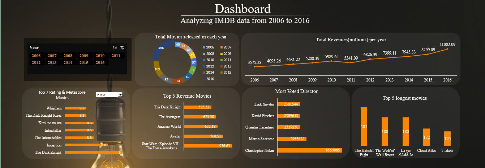

# Analyzing-IMDB-data-from-2006-to-2016
* Data management is important because the data your organization creates is a
very valuable resource.
* The last thing you want to do is spend time and resources collecting data and
business intelligence, only to lose or misplace that information.
* In that case, you would then have to spend time and resources again to get that
same business intelligence you already had.
* And on that data analysis is carried out which show visualization of our
problems in efficient way.
* Data Analysis is a process of inspecting, cleansing, transforming, and
modeling data with the goal of discovering useful information, informing
conclusions, and supporting decision- making.
* This project is based on such data analysis on IMDb data from 2006 to 2016
* IMDb is an online database of information related to films, television
programs, home videos, video games, and streaming content online –
including cast, production crew and personal biographies, plot summaries,
trivia, ratings, and fan and critical reviews.
*This IMDb dataset contains 12 data fields.
## The dataset is based on 1000 popular movies on IMDb from 2006 to 2016
After analysis of the dataset, the aim of this project is to give answer of given objectives in easy way:
* Total revenues earned by movies in each year
* Total Movies released in each year
* Top 7 IMDb rating movies and metascore movies
* Top 5 revenue movies from whole dataset or each year
* Most voted director from whole dataset or in each year
* Top 5 longest movies from whole dataset or in each year
  

